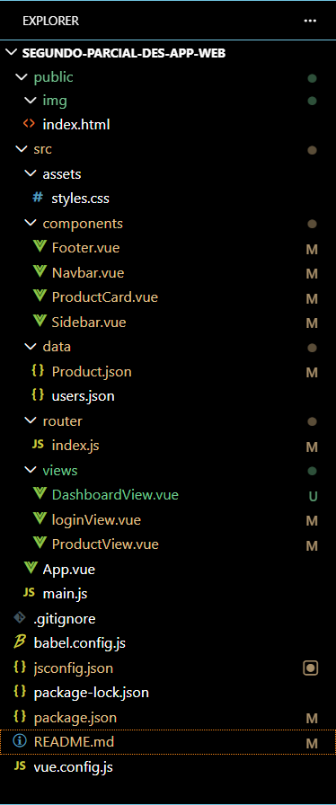

# segundo-parcial-des-app-web
# TechNova 🛒💻

 Aplicación web de e-commerce para productos tecnológicos, desarrollada con Vue.js 3 como proyecto del segundo parcial de Desarrollo de Aplicaciones.


## 📋 Descripción General

TechNova es una tienda virtual de tecnología que permite a los usuarios explorar, filtrar y agregar al carrito productos como laptops, smartphones, audífonos, monitores, tablets y periféricos.

### Objetivo de la Aplicación

- Brindar una experiencia de compra intuitiva y moderna.
- Permitir al usuario navegar por categorías de productos.
- Gestionar un carrito de compras persistente mediante `localStorage`.
- Demostrar el uso de Vue.js 3 con Vue Router, componentes reutilizables y comunicación entre componentes.

## 👥 Integrantes / Desarrolladores

maryi ospino | 0192593 | login y las imagenes de los productos 
anderson garcia | 0192677 | deshboard y componentes 

## 🗂️ Estructura del Proyecto



## 🧩 Modularización: Componentes, Vistas y Rutas

### Componentes (`src/components/`)


| `Navbar.vue` | Muestra el logo, links de navegación y el carrito desplegable con conteo de ítems |
| `Sidebar.vue` | Lista las categorías de productos con conteo y permite filtrar desde cualquier vista |
| `ProductCard.vue` | Tarjeta reutilizable que recibe un producto por `props` y emite eventos al agregar o ver detalles |
| `Footer.vue` | Pie de página estático |

### Vistas (`src/views/`)


| `loginView.vue` | `/login` | Formulario de autenticación de usuario |
| `DashboardView.vue` | `/dashboard` | Layout principal que incluye Navbar, Sidebar y bienvenida |
| `ProductView.vue` | `/dashboard/productos` | Grilla de productos con filtro por categoría, alertas y modal de detalles |

### Rutas (`src/router/index.js`)

```javascript
const routes = [
  { path: '/', redirect: '/login' },
  { path: '/login', name: 'Login', component: LoginView },
  {
    path: '/dashboard',
    component: DashboardView,       // Layout padre con Navbar + Sidebar
    children: [
      { path: '', name: 'Inicio' }, // /dashboard → muestra bienvenida
      { path: 'productos', name: 'Productos', component: ProductView } // /dashboard/productos
    ]
  }
]
```

Las rutas hijas (`children`) permiten que `ProductView` se renderice dentro del `<router-view>` de `DashboardView`, manteniendo el layout (Navbar y Sidebar) en todo momento.

---

## 🌐 Consumo de Datos desde Archivo JSON (API Local)

Los productos se cargan desde `src/data/Product.json`, simulando el consumo de una API externa. En `ProductView.vue`:

```javascript
import productosData from '../data/Product.json'

function cargarProductos() {
  const guardados = localStorage.getItem('technova_productos')
  if (guardados) {
    // Si ya existen en caché, los usa directamente
    productos.value = JSON.parse(guardados)
  } else {
    // Si no, carga desde el JSON y los persiste
    productos.value = productosData
    localStorage.setItem('technova_productos', JSON.stringify(productosData))
  }
}
```

### Estructura de un producto en `Product.json`

```json
{
  "id": 1,
  "imagen": "/img/mba_13_m3_2024_hero.png",
  "nombre": "MacBook Air M3",
  "categoria": "Laptops",
  "precio": 6499000,
  "stock": 8,
  "descripcion": "Laptop ultradelgada con chip Apple M3, 8GB RAM, 256GB SSD"
}
´´´
```
## 🔗 Comunicación entre Componentes

### Props: de `ProductView` → `ProductCard`

`ProductView` pasa cada producto como prop a `ProductCard`:

```vue
<!-- ProductView.vue -->
<ProductCard
  :producto="producto"
  @agregar-carrito="agregarAlCarrito"
  @ver-detalles="verDetalles"
/>
```

```vue
<!-- ProductCard.vue -->
<script setup>
defineProps({
  producto: {
    type: Object,
    required: true
  }
})
defineEmits(['agregar-carrito', 'ver-detalles'])
</script>
```

### Eventos: de `ProductCard` → `ProductView`

`ProductCard` emite eventos hacia arriba cuando el usuario interactúa:

```vue
<!-- ProductCard.vue -->
<button @click="$emit('agregar-carrito', producto)">Agregar</button>
<button @click="$emit('ver-detalles', producto)">Ver</button>
```

`ProductView` escucha esos eventos y ejecuta la lógica:

```javascript
function agregarAlCarrito(producto) {
  const carrito = JSON.parse(localStorage.getItem('technova_carrito') || '[]')
  const existe = carrito.find(p => p.id === producto.id)
  if (existe) {
    existe.cantidad++
  } else {
    carrito.push({ ...producto, cantidad: 1 })
  }
  localStorage.setItem('technova_carrito', JSON.stringify(carrito))
  window.dispatchEvent(new Event('carrito-actualizado')) // Notifica al Navbar
}
```

### Eventos globales: `ProductView` → `Navbar`

Para sincronizar el carrito entre componentes no relacionados se usa `window.dispatchEvent`:

```javascript
// ProductView.vue — dispara el evento
window.dispatchEvent(new Event('carrito-actualizado'))

// Navbar.vue — escucha el evento
onMounted(() => {
  window.addEventListener('carrito-actualizado', sincronizar)
})
```

---

## 🤝 Evidencia de Trabajo Colaborativo

### Ramas del repositorio

 maryi ospino | Desarrollo del carrito |
 anderson garcia | componentes y dashvoard|
 maryi ospino | login |


## 🚀 Instalación y Ejecución

```bash
# Clonar el repositorio
git clone https://github.com/tu-usuario/segundo-parcial-des-app.git

# Instalar dependencias
npm install

# Ejecutar en desarrollo
npm run dev

# Compilar para producción
npm run build
```

---

## 🛠️ Tecnologías Utilizadas

- **Vue.js 3** — Framework frontend con Composition API
- **Vue Router 4** — Manejo de rutas y navegación SPA
- **Bootstrap 5** — Estilos y componentes UI
- **Vite** — Bundler y servidor de desarrollo
- **localStorage** — Persistencia del carrito de compras
